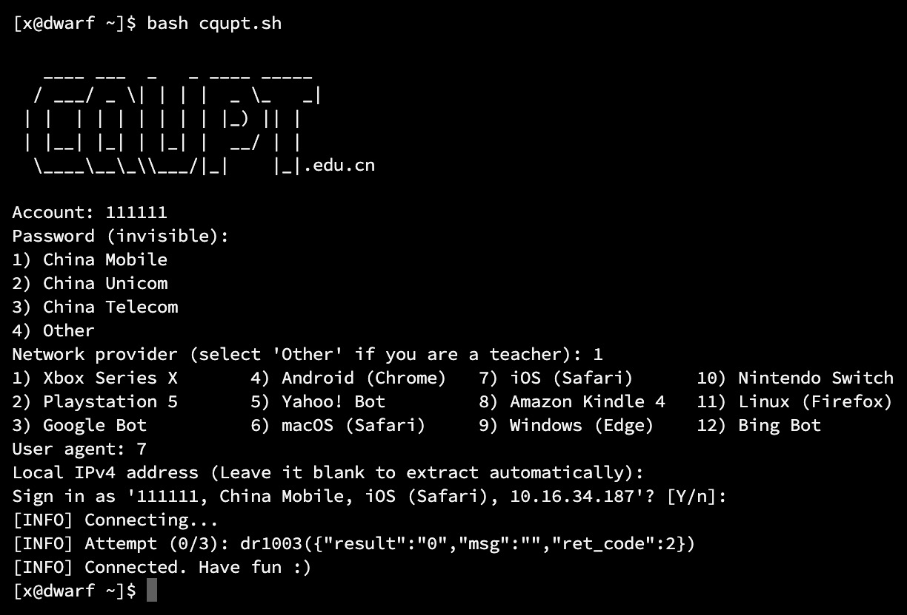

# 📶 CQUPT 校园网登录脚本

该脚本用来给 CQUPT 内网设备登录校园网，给你自己电脑用也行，随便你。另外，该脚本仅供学习，出现的任何问题和作者无关。

该 Shell 脚本专为 Linux 设备准备，如果你用的是 Windows 或 Mac 设备，请使用 Python3 重制版 [cqupt.py](./cqupt.py)，并直接查看该 [重制版的使用说明](#python3-重制版)。



## 特点

- [x] 支持移动、电信、联通校园网
- [x] 支持自定义 [User-Agent](https://developer.mozilla.org/en-US/docs/Web/HTTP/Headers/User-Agent)，可能能用于多设备同时登录（
- [x] 是我写的

## 使用

在使用前先连上该校有线或无线校园网，并确定你的设备装有
- Bash 5 或更高的版本
- [cURL](https://curl.se/)

检查 Bash 版本

```bash
bash --version
```

下载并进入该仓库

```bash
git clone https://github.com/mivinci/cqupt.git
cd cqupt
```

运行脚本并根据提示操作
```bash
bash cqupt.sh
```

## Python3 重制版

Python3 重制版为跨平台通用版本，需要你的设备上预先装有 Python3 环境。假设你的统一认证码为 111111，密码为 222222，网络服务提供商为中国电信，介绍三种使用方式，区别在于密码的输入。

方法一（手动现输入）

```bash
python cqupt.py 111111 --isp telecom
```

然后根据提示输入密码（输入过程密码不可见）

方法二（通过管道）

```bash
echo -n '222222' | python cqupt.py 111111 --isp telecom
```

方法三（通过环境变量）

```bash
export CQUPT_UAC_PASSWORD=222222
python cqupt.py 111111 --isp telecom 
```

其中，`--isp` 参数指定网络服务提供商名称，支持的名称如下：

- 中国电信：`telecom`
- 中国联通：`unicom`
- 中国移动：`cmcc` (默认)
- 教师账号：`xyw`

当然，你可以运行

```
python cqupt.py -h
```

来查看完整参数，如自定义 IP/MAC 地址，自定义 UA 等。

## FAQ

1. 问：我的设备是通过自己的路由器连接的校园网还能用该脚本吗？

   答：可以，但需要自行输入路由器的内网 IPv4 地址。

2. 问：怎么设置该脚本为开机自启或定时运行？
   
   答：Linux, Mac, Windows 有各自开机自启和定时运行的方式和工具，自行谷歌。

3. 问：我不在内网里怎么通过 ssh 登录内网设备？

   答：这不在该脚本的涉及范围，但极力推荐使用 [Tailscale](https://tailscale.com)。

4. 问：这个脚本会影响我开法拉利吗？

   答：应该不会。

## 反馈

Bug 发 [这儿](https://github.com/mivinci/cqupt/issues)，想法发 [这儿](https://github.com/mivinci/cqupt/discussions)，或直接通过 QQ 0x51768d60 通知我 :)

## License

本项目使用 Apache 2.0 开源协议
